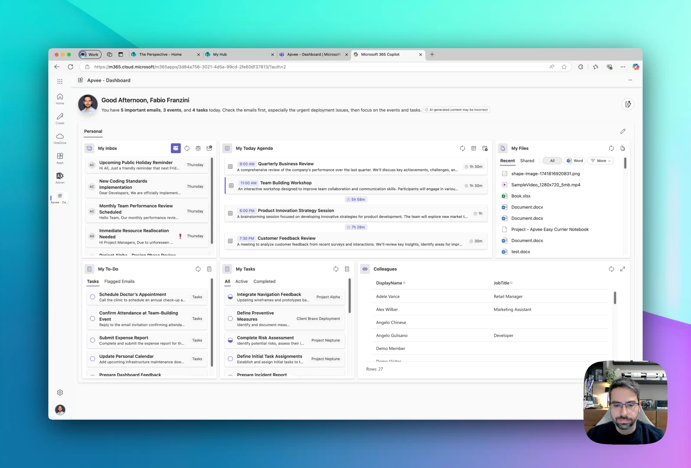

# Apvee Dashboard - SharePoint Hackathon Spring 2025

## 🚀 Overview
**Apvee Dashboard** is an advanced and highly customizable Web Part developed by **Apvee Solutions**. It is designed to enhance productivity by providing users with a dynamic, AI-powered dashboard that integrates personal and work-related data into a single, intelligent interface. While the solution was not specifically developed for the **SharePoint Hackathon Spring 2025**, it is being presented as an innovative approach to personal productivity within Microsoft 365.

Apvee Dashboard leverages the power of **SharePoint Framework (SPFx)**, **Azure Functions**, and **LangchainJS**, along with **Azure AI Foundry** for LLM-powered insights. It enables users to build a personalized workspace with a set of interactive widgets, each designed to help manage emails, meetings, tasks, and files more effectively. The solution supports seamless integration across **SharePoint portals, Microsoft Teams, and the Microsoft 365 Home page**, ensuring a consistent experience regardless of where it's accessed.

With **intelligent AI-driven analytics**, Apvee Dashboard not only aggregates key information but also provides **context-aware recommendations**, making it easier for users to stay on top of their daily responsibilities. By storing user settings in the `Apps` folder of OneDrive, the dashboard remains personalized and accessible across devices without requiring manual reconfiguration.

🎯 **Key Features:**
- **Customizable Dashboard**: Users can compose a dashboard with multiple widgets focused on personal data.
- **Widgets Available**: Inbox, Agenda, Tasks, To-Do, My Files, and more.
- **Responsive Grid Layout**: Drag-and-drop positioning with isolated widget settings.
- **Persistent Settings**: Configuration is stored in the `Apps` folder on OneDrive and loaded per user.
- **AI-Powered Insights**: Context-aware intelligence for improved productivity.
  - **Short AI Recap**: Quick summary based on emails, today’s agenda, and tasks.
  - **Detailed AI Recap**: In-depth suggestions for a productive day.
  - **AI-Powered Email Insights**: Contextual information and proactive recommendations.
  - **AI-Powered Agenda Insights**: Smart scheduling suggestions.
  - **AI-Powered Task Insights**: Proactive task prioritization.
- **Seamless Integration**: Works within SharePoint portals, Microsoft Teams, or Microsoft 365 Home.
- **Powered by Azure AI Foundry**: Utilizing advanced LLM models for intelligent recommendations and insights.

## 📺 Demo Video

## 🏗️ Technology Stack
- **SharePoint Framework (SPFx)**
- **React + Fluent UI 9**
- **Azure Functions** (for backend processing)
- **LangchainJS** (for AI-driven insights)
- **PnPJS** (for SharePoint/Graph API interactions)
- **Microsoft Graph API** (for personal data integration)
- **Azure AI Foundry** (for LLM-based AI features)

## 🚀 Roadmap
- 🔄 More Widgets and Features
- ✨ Enhanced AI Features and Actionables

## 🤝 Contributing
**This repository does not contain the source code and contributing are not accepted**!  
It is intended for presenting the Apvee Dashboard at the **SharePoint Hackathon Spring 2025**.  
If you are **interested in a demo or partnership**, please reach out to us.

## 📨 Contact
📧 **Apvee Solutions** - [hello@apvee.com](mailto:hello@apvee.com)  
🌍 **Website** - [https://apvee.com](https://apvee.com)